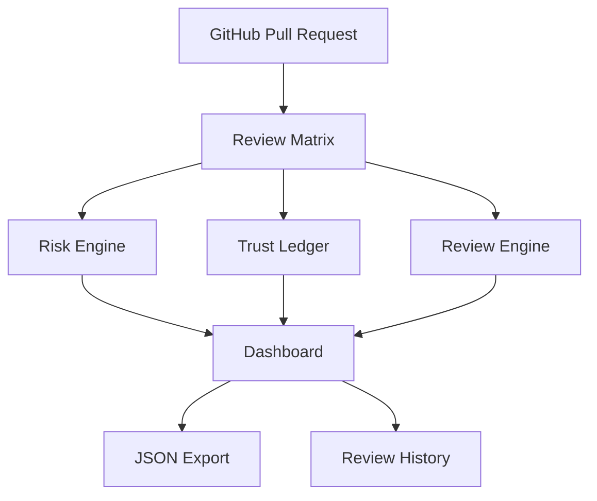

# 🚀 Review Matrix

<p align="center">

</p>

<p align="center">
<b>AI-Powered Pull Request Risk Intelligence</b>
</p>

<p align="center">
Review AI-generated pull requests using deterministic risk scoring,
weighted trust analysis, explainable recommendations, and structured review workflows.
</p>

<p align="center">

[]()
[]()
[]()
[]()
[]()

</p>

<p align="center">
<a href="https://review-matrix.vercel.app">🌐 Live Demo</a>
&nbsp;&nbsp;•&nbsp;&nbsp;
<a href="https://github.com/brindanaik2708/Review-Matrix">GitHub Repository</a>
</p>

---

## Overview

Review Matrix helps developers review AI-generated pull requests using deterministic risk analysis, explainable recommendations, weighted trust tracking, and structured review decisions.

Unlike traditional PR review tools, Review Matrix focuses on **trust**, **transparency**, and **human-in-the-loop decision making**.

---

## Key Features

| Feature | Description |
|---------|-------------|
| 🔍 Deterministic Risk Engine | Classifies every PR hunk using rule-based analysis |
| 🤖 AI Fix Suggestions | Shows deterministic fixes with example code |
| 📊 Risk Dashboard | Live risk distribution and review metrics |
| 🔎 Smart Search & Filters | Instantly locate risky files and hunks |
| ✅ Review Workflow | Approve, Redirect, or Request Changes |
| 📈 Trust Ledger | Weighted trust score from historical reviews |
| 📂 Review History | Stores exported reviews locally |
| 📤 JSON Export | Export complete review decisions |
| 🌙 Theme Support | Dark & Light mode with persistence |

---

## Architecture



---

## Risk Categories

| Category | Purpose |
|----------|---------|
| Authentication | Login, OAuth, JWT |
| Database | Queries & Schema |
| Secrets | API Keys & Tokens |
| Dependencies | Package Security |
| Logic | Business Rules |
| Performance | Expensive Operations |
| Migration | Database Changes |
| PII | Sensitive User Information |

---

## Technology Stack

| Layer | Technology |
|--------|------------|
| Framework | Next.js 15 |
| Language | TypeScript |
| Styling | Tailwind CSS |
| Charts | Recharts |
| Testing | Vitest + Playwright |
| Deployment | Vercel |

---

## Local Setup

```bash
git clone https://github.com/brindanaik2708/Review-Matrix.git
cd Review-Matrix
npm install
npm run dev
```

Open:

```
http://localhost:3000
```

---

## Validation

```bash
npm test
npm run typecheck
npm run build
```

---

## Project Structure

```text
app/
components/
data/
lib/
tests/
public/
```

---

## Why Review Matrix?

- Explainable AI
- Deterministic Risk Analysis
- Weighted Trust Ledger
- AI Fix Suggestions
- Interactive Review Workflow
- JSON Export
- Production Ready
- Mobile Responsive

---

## Developer

**Brinda Naik**  
B.Tech Computer Engineering  
Sarvajanik College of Engineering & Technology

---

## License

MIT License
