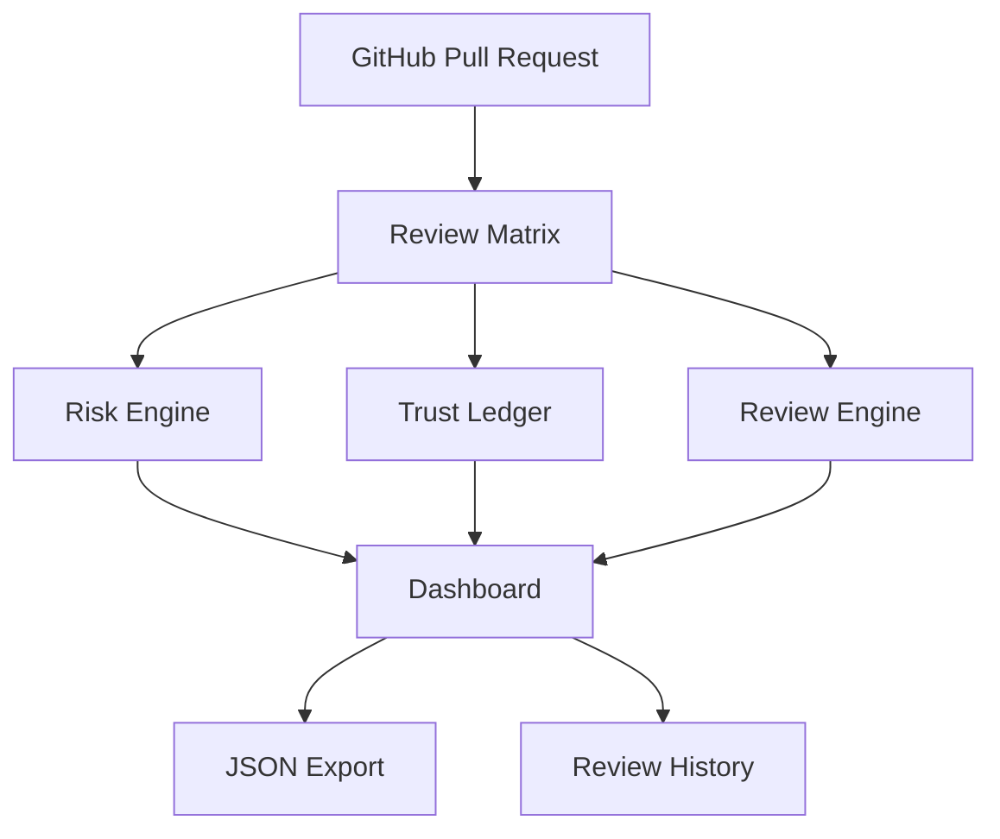

# 🚀 Review Matrix

> **AI-Powered Pull Request Risk Intelligence**

Review Matrix is an AI-assisted pull request review platform that helps developers review AI-generated code using deterministic risk scoring, explainable recommendations, weighted trust tracking, and structured review workflows.

**🌐 Live Demo:** https://review-matrix.vercel.app

**💻 GitHub:** https://github.com/brindanaik2708/Review-Matrix

---

## ✨ Features

- 🔍 Deterministic Risk Scoring
- 🤖 AI Fix Suggestions
- 📊 Live Risk Distribution Dashboard
- 🔎 Search & Filter PR Hunks
- ✅ Approve • Redirect • Request Changes
- 📈 Weighted Trust Ledger
- 📂 Review History
- 📤 JSON Export
- 🌙 Dark / ☀ Light Theme
- 📱 Responsive & Accessible UI

---

## 🏗 Architecture



---

## 🧠 How It Works

```text
GitHub PR
      │
      ▼
Review Matrix
      │
      ├── Risk Analysis
      ├── Trust Calculation
      ├── Suggested Fixes
      ├── Reviewer Decisions
      ▼
Dashboard
      ▼
JSON Export
```

---

## 📊 Risk Categories

| Category | Purpose |
|----------|---------|
| 🔐 Authentication | Login, JWT, OAuth |
| 🗄 Database | Queries & Schema |
| 🔑 Secrets | API Keys & Tokens |
| 📦 Dependencies | Package Security |
| 🧠 Logic | Business Logic |
| ⚡ Performance | Expensive Operations |
| 🔄 Migration | Schema Changes |
| 👤 PII | Sensitive User Data |

---

## ⚙ Tech Stack

| Layer | Technology |
|--------|------------|
| Framework | Next.js 15 |
| Language | TypeScript |
| Styling | Tailwind CSS |
| Charts | Recharts |
| Testing | Vitest + Playwright |
| Deployment | Vercel |

---

## 🚀 Local Setup

```bash
git clone https://github.com/brindanaik2708/Review-Matrix.git

cd Review-Matrix

npm install

npm run dev
```

Open:

```
http://localhost:3000
```

---

## 🧪 Validation

```bash
npm test

npm run typecheck

npm run build
```

---

## 📂 Project Structure

```text
app/
components/
data/
lib/
tests/
public/
```

---

## 🔐 Optional AI Mode

Review Matrix works **without any API key**.

Optionally configure:

```env
OPENAI_API_KEY=
OPENAI_MODEL=
```

to improve explanation text while keeping deterministic risk scoring unchanged.

---

## 🎯 Why Review Matrix?

✔ Explainable AI

✔ Deterministic Risk Engine

✔ Weighted Trust Ledger

✔ AI Fix Suggestions

✔ Interactive Review Workflow

✔ JSON Export

✔ Production Ready

---

## 👩‍💻 Developer

**Brinda Naik**

B.Tech Computer Engineering

Sarvajanik College of Engineering & Technology

---

## 📄 License

MIT License
